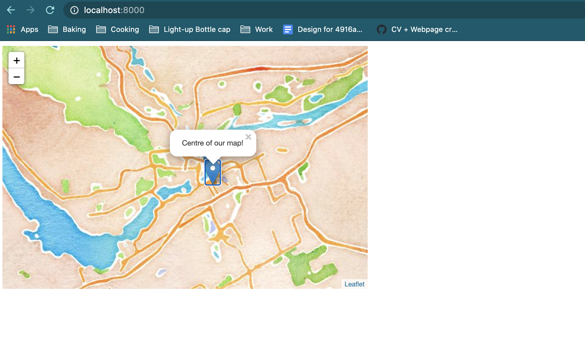

# Week 10: Notes

- Well, I already have a website --> my blog as a research compendium?

- Fabricius Workbench
  - Obviously I must do this activity --> doesn't every kid who loves history/archaeology go through an ancient Egypt phase?
  - Tutorial
    - Would much prefer reading this tutorial without a bunch of videos playing in the background --> can't c/p any of the text?
    - Reminds me of what I had to do with weathered headstones --> to decipher some I had to mess around in photoshop
    - Similar sort of technology to when you draw characters in google translate and it identifies the character?
  - Seems like an easy-to-use tool that could be fun for hobbiests and professionals alike
  - Not sure how to look for pics of crumbling hieroglyphics
    - Googling "hieroglyphics" just gives me famous stuff
    - Stock photos of hieroglyphics surprisingly common
    - MUSEUMS
      - ROM site under maintenance
      - Thank you Ben Stiller for reminding me about the Smithsonian
        - [The Smithsonian has a git repo AND an API amazing](https://www.si.edu/openaccess/devtools)
        - Okay [this seems like what I'm looking for](https://www.si.edu/object/archives/components/sova-eepa-1973-001-ref33863
  - I can't tell how they cropped the image?
  - This analysis sequence part is kind of hard to do/understand
    - I know I'm outlining the glyphs but everything is separated --> not sure how to indicate that 2 "separated" glyphs are supposed to be together as one word
    - Auto-marquee doesn't acknowledge both glyphs, just one
    - Oh just dicovered that the eraser tool erases everything and not just what you draw
      - Wish the tutorial was a bit more in-depth/descriptive
    - Even after erasing, only 1 of the 2 glyphs making a single word are recognized...
      - Will identify them separately I guess
      - Update: got them to group together by doing A LOT of erasing and filling in the one that kept being ignored
    - When was this made/how well known is it? --> kind of bad at identifying even very clear/'obvious' shapes
    - Wait what does the circle thing around my glyphs mean
      - Oh apparently I'm translating [the name of someone royal](https://matadornetwork.com/read/interpret-hieroglyphics-guide/)
      - Read right-to-left --> line of cartouche appears to indicate end of phrase
  - First glyph (on right) looks like a person shape, but head cut off so can't tell which
  - How do you translate if auto-translate doesn't work?
    - The auto-translate tool works using "a dictionary service to which the program is connected" --> I have no idea what this service is or how to manually access it
    - I cannot read list of auto-translate results
    - Attempt at translating
      - First thing is V28/wick --> "ḥḥ"
        - Eternity/immortality
      - Rectangle is probably Q3 --> stool, common usage is for the name of god Ptah
      - Semi-circle is loaf of bread --> X1
        - Also indicates noun is feminine
      - Squiggle is ripple of water --> letter n (+of,by)
      - Hoe is U6 --> according to Gardier guide that I googled:
        ```
        1. bil. mr, for "beloved";
        2. used in Pharaoh, individuals, other names, etc.: (Pharaoh XX, Beloved of God/Goddess YY)
        ```
      - Two reeds "y" according to tutorial
      - Person figure "determinative" according to tutorial --> "y" a name???
    - So just read [this](https://www.academia.edu/34639783/Ancient_Egyptian_Hieroglyphics_Signs_with_Phonetics_Reading_and_Descriptions) to try and learn how to read the stacked part at the beginning
      - I THINK the characters above squiggle are supposed to be one reference to deity --> "immortal Ptah"?
      - Squiggle is "of" connecting to word before stack --> hoe/"beloved"
    - "Beloved of Immortal Ptah"? --> going to google that and see what royals comes up
      - [Seti I](https://pharaoh.se/pharaoh/Seti-I) seems to be written similar to my hieroglyphics --> "Seti" two reeds and god Seth (C7)
      - Apparently other Seti (II) --> variant in birth name almost identical to my hieroglyphic!!!
    - CONCLUSION: Likely a mention of Seti II
      - Checks out --> [he had a small temple at temple of Karnak where photo was taken](https://en.wikipedia.org/wiki/Seti_II#/media/File:Karnak_Tempel_Vorhof_10.jpg)
  - Thoughts
    - "Often, the machine learning model gets it right on the first go. Sometimes you need to select the second or third prediction..." --> it didn't once correctly predict on first go, and only twice were one of the other predictions accurate
    - Heavily relient on technology/emphasis on machine learning and AI aspect of this tool
      - Frustrating to me as a user when their technology does not work as expected --> no alternative, manual or otherwise, offered
    - Can't tell if this is meant to be for "everyone" to explore or for those with prerequisite knowledge --> tutorial only give brief explanation on how to actually read the hieroglyphics and does not link to any resources that explain further aside from Gardier citation
      - Became more of *me* teaching myself to read hieroglyphics because the tool couldn't identify them as implied

- Graveyard Compendium
  - I really like how instructive rrtools is
  - Rmd is like latex but more specific with formatting
  - Thoughts on graveyard data
    - What columns have least amount of missing data unrelated to uncontrolled factors (weather, location, etc... although location vs physical grave condition could make an interesting map...)?
      - Cross compare monument type vs date --> perhaps could speak to architectural/artistic trends of time period?
      - Cross compare letter style vs date --> would have to clean the data a bit to use because of the occasional combinations which would have to be separated
      - COMPARE ALL 3! --> shifting aesthetics of each time period
      - And then map it all to see what happens? --> wondering if aesthetics also changed by location
  - First gather and clean data I need --> Burial ground name, latitude, longitude, condition of monument, condition of inscription, monument type, letter styles, date
    - Oh there's no category for name that's unfortunate --> feel weird about separating the person from their gravestone
  - Why must R count starting from 1
    - Okay NOW needed data all in new df `gvredux`
  - x-axis = year, y-axis = count of data
    - Check with monument type vs year --> not actually good as line graph because monument type codes not linear
      - Stream graph! --> proportions of monument types by year more beneficial for analyzing trends
    - Bye ggplot2 hello [streamgraph](https://www.r-graph-gallery.com/streamgraph.html)
    - Have to remove NA years
  - Oh cool it's horrific --> not a lot of overlapping data means a kind of wonky stream graph
  - Try again with letter styles
    - Trying to separate rows that list multiple styles in one line --> have no idea how to do this in R
    - Everything I find with tidyr is just slightly off
    - Going to bounce to trying to map data for now to see what happens
  - Mapping
    - Stealing my modified graveyard data
      - Will modify column names manually real quick
      - Looks like I have to remove NAs in lat/long --> re-exported
    - Okay for whatever reason, somehow, the map is pulling point data from the original activity?!
    - These points do not exist in my index or geojson in this file... my terminal is in the right directory... how...
    
